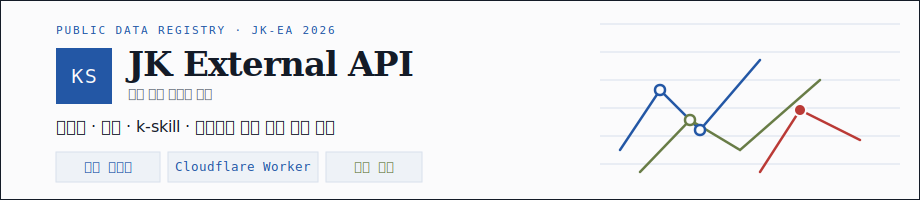
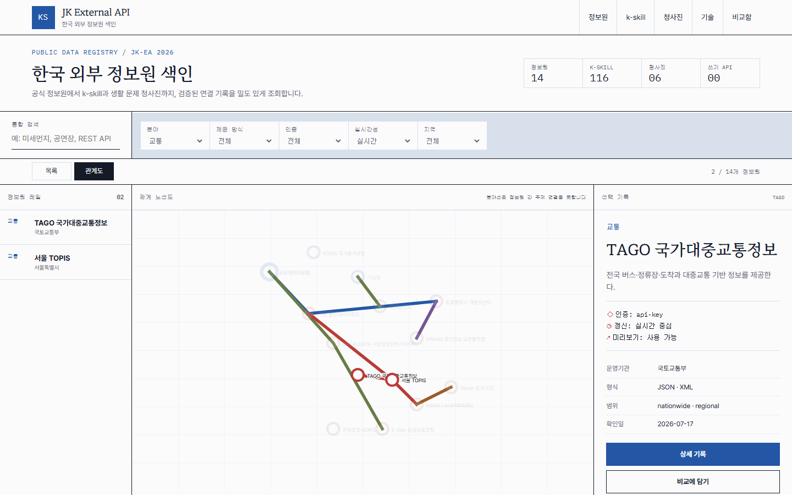
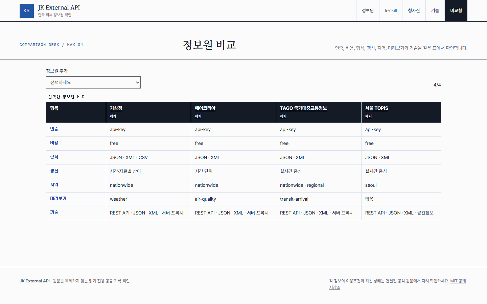
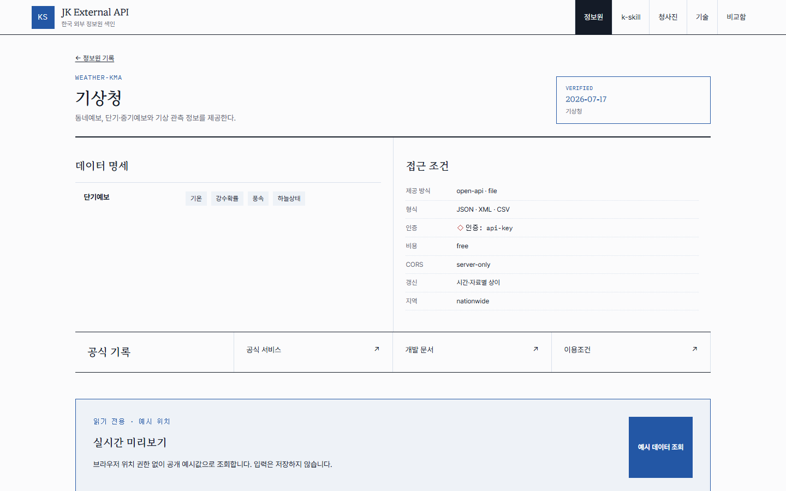
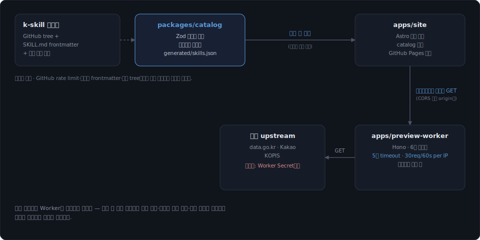

<p align="center">
  
</p>

<p align="center">
  
  
  
  
  
  
  
  
</p>

**JK External API**는 한국에서 생활·지역 프로젝트를 만들 때 필요한 외부 정보원, 데이터 종류, 기술, [NomaDamas/k-skill](https://github.com/NomaDamas/k-skill), 프로젝트 청사진을 연결하는 **읽기 전용 공개 색인**(Astro 정적 사이트)이다.

- 공식 정보원 그룹 **14개**를 확인일·귀속·이용조건·개발 문서 링크와 함께 담는다.
- upstream k-skill `SKILL.md` 전체 스냅샷(활성 + legacy 기록)을 그대로 보여준다.
- 출퇴근·동네 인프라·안전환경·지역문화·이동약자·가족주말, **청사진 6종**을 코드 예제와 함께 제공한다.
- 명시 좌표 기반 **홈 관계도**, 통합 검색과 복합 필터, 최대 **4개 비교**를 지원한다.
- 날씨·대기·대중교통·공공시설·장소·공연의 선택적 읽기 전용 **Worker 미리보기**를 붙인다.

운영 주소: <https://rafaam11.github.io/jk-external-api/>

원문 데이터는 저장소에 복제하지 않는다. 요약 메타데이터·귀속·공식 링크·확인일과 생성된 k-skill frontmatter 스냅샷만 보관하며, 데이터베이스·로그인·쓰기 API·사용자 위치 권한·사용자 추적·쿠키 저장은 없다.

## 미리보기

<p align="center"></p>

<p align="center"><em>홈의 <code>관계도</code> 모드 — 통합 검색·복합 필터를 지나 관계도에서 노드를 선택하면 오른쪽 선택 기록 패널에 상세가 뜬다.</em></p>

### 페이지 둘러보기

<table>
  <tr>
    <td width="50%"><br><sub><b>비교</b> — 최대 4개 정보원을 표로, <code>?ids=</code> 딥링크로 상태 공유</sub></td>
    <td width="50%"><br><sub><b>정보원 상세</b> — 접근 조건·공식 링크·읽기 전용 실시간 미리보기</sub></td>
  </tr>
</table>

## 빠른 시작

1. 운영 주소(<https://rafaam11.github.io/jk-external-api/>)를 브라우저로 연다 — **설치가 필요 없다**.
2. 홈의 **통합 검색** 또는 **관계도**로 정보원을 찾는다.
3. 로컬에서 실행하려면 아래 [개발](#개발)을 본다.

## 주요 기능

- **홈 (관계도)** — 명시 좌표(`home.x`/`home.y`/`home.lines`) 기반 12열 구성(2열 정보원 레일 · 7열 SVG 노선도 · 3열 선택 기록). 도메인별 노선 색 + 아이콘 + 텍스트 라벨을 함께 표기하고, 좁은 화면에서는 검색→분야→정보원→상세 순서의 동등한 텍스트 목록으로 대체된다.
- **통합 검색 · 복합 필터** — 이름·요약·키워드·필드·기술 전체를 인덱싱한 검색과, 분야·전달방식·인증·실시간성·지역 범위를 동시에 적용하는 필터.
- **비교 (최대 4개)** — 정보원을 최대 4개까지 표로 나란히 놓고, `?ids=` URL 딥링크로 상태를 공유한다.
- **정보원 레지스트리** — 공식 정보원 그룹 14개, 확인일·귀속·접근 조건·공식 링크가 붙은 상세 레코드.
- **k-skill 스킬 뷰** — upstream `SKILL.md` 전체 스냅샷(활성 + legacy), 분류별 목록과 상세.
- **청사진 6종** — 출퇴근·동네 인프라·안전환경·지역문화·이동약자·가족주말, 최소 서버 호출 예제 코드 + 클립보드 복사.
- **기술 레지스트리** — 프로토콜·기술 색인과 관련 정보원 역참조.
- **Worker 미리보기 위젯** — 날씨·대기·대중교통·공공시설·장소·공연 6종, 선택적·읽기 전용. 실패해도 정적 상세와 공식 링크는 계속 동작한다.
- **원문 데이터 미보관** — 저장소는 요약 메타데이터·귀속·공식 링크·확인일만 갖는다. 실제 값은 항상 공식 원문이나 선택적 미리보기로 확인한다.

## 사용법

### 홈
기본 진입은 **정보원 레지스트리** 표다. 상단 **통합 검색** 입력과 **분야 · 제공 방식 · 인증 · 실시간성 · 지역** 필터를 조합해 좁힌 뒤, **관계도** 버튼을 누르면 같은 결과가 노선도로 바뀐다. 노드를 클릭(또는 포커스 후 Enter)하면 오른쪽 **선택 기록** 패널에 상세가 뜬다. 모바일 화면에서는 노선도 대신 **노선도의 텍스트 대체 목록**이 동일한 정보를 순서대로 보여준다.

### 비교
`/compare/?ids=a,b,c,d` 형태의 딥링크로 최대 4개 정보원을 바로 비교표에 올릴 수 있다. 헤더는 스크롤 중에도 고정되고, 각 열의 이름을 클릭하면 해당 정보원의 상세 다이얼로그가 뜬다.

### 정보원 상세
`/sources/<id>/` 직접 라우트나 목록의 행 클릭(다이얼로그, `?view=source:<id>`) 두 경로로 들어갈 수 있다. **예시 데이터 조회** 버튼을 누르면 Worker 미리보기를 호출하고, Worker가 설정돼 있지 않거나 실패하면 `NOT_CONFIGURED` 등 오류 코드가 그 자리에서만 뜬다 — **공식 원문 열기** 링크는 항상 동작한다.

### 기술 페이지
기술 레지스트리 표에서 항목을 클릭하면 다이얼로그로 상세와 **관련 정보원** 역참조가 뜬다.

### 청사진
각 청사진은 **최소 서버 호출 예제** 코드 블록을 포함하고, **코드 복사** 버튼으로 클립보드에 담긴다. 예제에는 실제 사용 시 채워야 할 환경변수(예: `process.env.DATA_GO_KR_API_KEY`)가 그대로 들어 있다.

### k-skill 스킬 뷰
목록은 **분류** 필터로 좁힐 수 있고, upstream QA fixture는 제외돼 있다. `legacy/unsupported-skills` 문서는 `legacy-*` ID로 구분 표시된다.

## 아키텍처

<p align="center"></p>

`packages/catalog`가 Zod로 검증한 데이터를 갖고 있고, `apps/site`는 **빌드 시점**에 그 데이터를 번들해 GitHub Pages로 서빙한다(런타임 호출이 아니다). 브라우저의 미리보기 위젯만 선택적으로 `apps/preview-worker`에 GET 요청을 보낸다. 정적 콘텐츠는 Worker에 의존하지 않는다 — 실패해도 위젯 안에서만 오류를 보여주고 나머지 페이지는 그대로 동작한다. 상세 설계는 [`docs/superpowers/specs/2026-07-17-jk-external-api-design.md`](docs/superpowers/specs/2026-07-17-jk-external-api-design.md) 참고.

## 안전장치

- 데이터베이스·로그인·쓰기 API·사용자 위치 권한·사용자 추적·쿠키 저장이 없다. 모든 관계는 Zod로 검증된 ID로만 연결된다.
- Worker는 6개 라우트로 allow-list돼 있고 일반 프록시가 아니다. GET·OPTIONS만 허용, 5초 upstream timeout, 정규화된 캐시 키, 클라이언트 IP당 30req/60s rate limit, 등록된 Pages/localhost origin에만 CORS 허용.
- 비밀키(`DATA_GO_KR_API_KEY`, `KAKAO_REST_API_KEY`, `KOPIS_SERVICE_KEY`)는 사이트의 `PUBLIC_*` 변수나 브라우저 번들에 절대 들어가지 않고, GitHub Environment secret과 Cloudflare Worker Secret으로만 취급된다.
- Worker 미리보기가 실패해도(timeout·429·5xx·형식 변경·비밀키 누락) 위젯 안에서만 표준화된 오류 코드로 드러나고, 정적 상세·공식 링크는 계속 동작한다.
- k-skill 동기화는 임시 파일을 원자적으로 교체한다 — GitHub rate limit, 잘못된 frontmatter, 잘린 tree에서는 기존 스냅샷을 그대로 둔다.
- Worker 배포는 `workflow_dispatch`와 GitHub `production` Environment 승인을 모두 통과해야 나간다 — 사람 승인 없이 배포될 수 없다.
- 카탈로그 테스트가 필수 필드·ID 중복·끊어진 관계·URL·날짜·홈 좌표·오래된 확인일을 검사해 데이터 정합성을 지킨다.

## 개발

Node.js 24와 pnpm 10이 필요하다. 모노레포는 pnpm workspaces로 관리된다 — `apps/site`(Astro + Preact), `apps/preview-worker`(Hono Cloudflare Worker), `packages/catalog`(Zod 공통 계약 + k-skill 동기화).

```bash
corepack enable
pnpm install
pnpm --filter @jk-external-api/site dev
pnpm --filter @jk-external-api/preview-worker dev
```

Worker 미리보기를 로컬에서 쓰려면 `apps/preview-worker/.dev.vars.example`을 `.dev.vars`로 복사하고 실제 키(`DATA_GO_KR_API_KEY`, `KAKAO_REST_API_KEY`, `KOPIS_SERVICE_KEY`)를 채운다. 사이트가 Worker를 쓰게 하려면 빌드 시 `PUBLIC_PREVIEW_API_BASE_URL`만 지정한다 — 값이 없거나 Worker가 실패해도 정적 상세와 공식 원문 링크는 계속 동작한다.

| 스크립트 | 설명 |
|---|---|
| `pnpm lint` | eslint 전체 검사 |
| `pnpm typecheck` | 워크스페이스별 tsc / astro check / wrangler types |
| `pnpm test` | 워크스페이스별 vitest |
| `pnpm build` | 워크스페이스별 빌드(astro build / wrangler deploy --dry-run) |
| `pnpm links` | `apps/site/dist` 내부 링크 검사 |
| `pnpm e2e` | Playwright E2E(먼저 `pnpm exec playwright install chromium`) |
| `pnpm check` | lint && typecheck && test && build |

카탈로그 테스트는 필수 필드·ID 중복·끊어진 관계·URL·날짜·홈 좌표·오래된 확인일을 검사한다. Worker 테스트는 6개 어댑터·빈 결과·timeout·429/5xx·형식 변경·cache·CORS·rate limit·비밀키 누락을 검사한다.

## k-skill 동기화

```bash
pnpm --filter @jk-external-api/catalog sync
```

동기화는 GitHub tree와 `SKILL.md` frontmatter를 읽고 수동 보정을 병합한 뒤 임시 파일을 원자적으로 교체한다. QA fixture는 실제 스킬이 아니므로 제외하고, `legacy/unsupported-skills` 문서는 `legacy-*` ID로 보존한다.

매주 월요일 09:00 KST workflow는 변경을 바로 공개하지 않고 검토 PR을 만들며, 링크나 운영 미리보기 장애는 이슈를 연다.

## 배포

- `main`은 GitHub의 공식 Pages artifact workflow로 정적 사이트를 배포한다.
- Worker는 `workflow_dispatch`와 GitHub `production` Environment 승인을 모두 통과해야 배포된다.
- 저장소 변수 `PUBLIC_PREVIEW_API_BASE_URL`에는 첫 Worker 배포 후 `workers.dev` 주소를 등록한다.

필요 secret: `CLOUDFLARE_API_TOKEN`, `CLOUDFLARE_ACCOUNT_ID`, `DATA_GO_KR_API_KEY`, `KAKAO_REST_API_KEY`, `KOPIS_SERVICE_KEY`.

## 이용조건

코드와 자체 문서는 [MIT](LICENSE)다. 외부 정보와 번들 폰트의 권리·귀속은 [THIRD_PARTY_NOTICES.md](THIRD_PARTY_NOTICES.md) 및 각 공식 링크를 따른다. 실제 서비스 전에는 각 제공기관의 최신 이용조건, 호출 한도, 표시 의무를 다시 확인하라.
